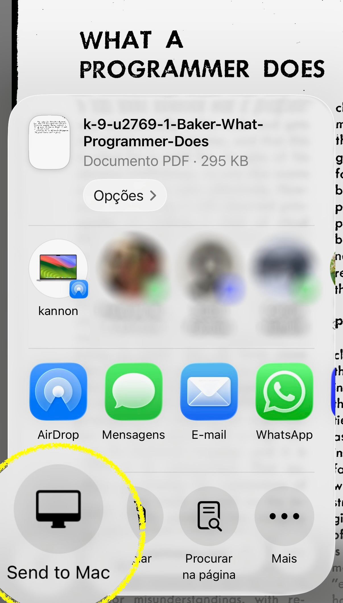

[Hyperduck](https://sindresorhus.com/hyperduck) is one of my all-time favorite apps. It's completely indispensable.

The way it works is simple. It's both [an iOS app and a macOS app](https://apps.apple.com/us/app/hyperduck/id6444667067). You leave it running on your Mac (in the background, unobtrusively and without any noticeable system impact). The iOS app adds an item to the link sharing menu: "Send to Mac". Select it, and the link will be shared to your Mac.

So simple, and so effective. It works no matter where you are in the world relative to your Mac, regardless of whether your Mac is turned on, awake, connected to the internet, whatever. The next time you open up your computer, the link will be there. Or all the links, there's no limit to how many times you can do this.

On the iOS end, it works anywhere you have a link to share. On the Mac end, you can use it with any browser. No AirDrop nonsense, no cloud tabs nonsense, it just works.

Yet another [excellent and focused Sindre Sorhus utility](https://sindresorhus.com/apps). More questions answered and information shared [in the FAQ](https://sindresorhus.com/hyperduck#faq).

