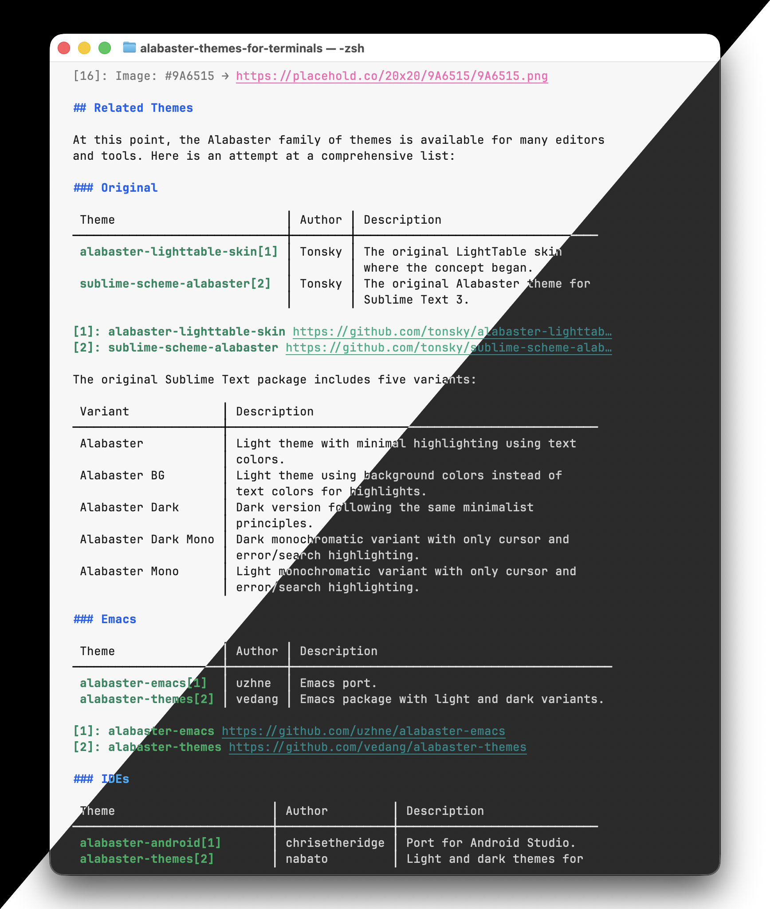

---
cover:
  image: alabaster-composite-terminal-theme.png
date: 2026-01-20
description: "Alabaster color themes for 14 terminal emulators"
externalUrl: "https://github.com/cboone/alabaster-themes-for-terminals"
title: "Alabaster Themes for Terminals"
---

Terminal color themes for Alabaster Dark and Alabaster Light, available for 14 different terminal emulators.

## Background

These terminal themes are inspired by [the Alabaster color scheme](https://github.com/tonsky/sublime-scheme-alabaster) created by [Nikita Prokopov (aka Tonsky)](https://github.com/tonsky) and the philosophy outlined in his blog post ["A case against syntax highlighting"](https://tonsky.me/blog/syntax-highlighting/).

In the original IDE themes, Alabaster highlights only four syntax classes: strings, constants, comments, and global definitions. Terminal themes are limited to 16 ANSI colors, but the same principle applies: use color sparingly and intentionally.

## Supported Terminals

- [Alacritty](https://alacritty.org/)
- [Contour](https://contour-terminal.org/)
- [foot](https://codeberg.org/dnkl/foot)
- [Ghostty](https://ghostty.org/)
- [iTerm2](https://iterm2.com/)
- [Kitty](https://sw.kovidgoyal.net/kitty/)
- [Konsole](https://konsole.kde.org/)
- [mintty](https://mintty.github.io/)
- [PuTTY](https://www.putty.org/)
- [Terminal.app](https://support.apple.com/guide/terminal/welcome/mac)
- [Tilix](https://gnunn1.github.io/tilix-web/)
- [Warp](https://www.warp.dev/)
- [WezTerm](https://wezterm.org/)
- [Windows Terminal](https://github.com/microsoft/terminal)

## Related Themes

At this point, the Alabaster family of themes is available for many editors and tools.

### Original

- [alabaster-lighttable-skin](https://github.com/tonsky/alabaster-lighttable-skin) — Tonsky's original LightTable skin where the concept began
- [sublime-scheme-alabaster](https://github.com/tonsky/sublime-scheme-alabaster) — Tonsky's original Alabaster theme for Sublime Text 3

The original Sublime Text package includes five variants: Alabaster, Alabaster BG (using background colors instead of text colors), Alabaster Dark, Alabaster Dark Mono, and Alabaster Mono.

### Emacs

- [alabaster-emacs](https://github.com/uzhne/alabaster-emacs) — Emacs port by uzhne
- [alabaster-themes](https://github.com/vedang/alabaster-themes) — Emacs package with light and dark variants by vedang

### IDEs

- [alabaster-android](https://github.com/chrisetheridge/alabaster-android) — Port for Android Studio by chrisetheridge
- [alabaster-themes](https://github.com/nabato/alabaster-themes) — Light and dark themes for JetBrains IDEs by nabato
- [intellij-alabaster](https://github.com/tonsky/intellij-alabaster) — Tonsky's original port for JetBrains IDEs
- [Travertine](https://github.com/freetonik/Travertine) — Alternative minimal theme for Sublime Text 2 and TextMate by freetonik
- [vscode-rubber-theme](https://github.com/apust/vscode-rubber-theme) — Dark VS Code variant using colors from the Plastic theme by apust
- [vscode-theme-alabaster](https://github.com/tonsky/vscode-theme-alabaster) — Tonsky's original VS Code port with light theme
- [vscode-theme-alabaster-dark](https://github.com/gargakshit/vscode-theme-alabaster-dark) — Dark variant for VS Code by gargakshit
- [zed-theme-alabaster](https://github.com/tsimoshka/zed-theme-alabaster) — Port for the Zed editor by tsimoshka

### Terminal Emulators

- [alabaster.nvim gists](https://gist.github.com/p00f) — Config snippets for Alacritty, fzf, Kitty, WezTerm, wofi, and zathura by p00f
- [iterm2-theme-alabaster](https://github.com/mkaschenko/iterm2-theme-alabaster) — iTerm2 theme by mkaschenko
- [kitty-alabaster](https://github.com/anmolmathias/kitty-alabaster) — Kitty theme by anmolmathias
- [warp-alabaster-theme](https://github.com/arsenydubrovin/warp-alabaster-theme) — Warp terminal theme by arsenydubrovin

### Vim and Neovim

- [alabaster.nvim](https://github.com/p00f/alabaster.nvim) — Neovim port with Treesitter support by p00f
- [alabaster.vim](https://github.com/sderev/alabaster.vim) — Vim colorschemes with five variants by sderev
- [vim-colors-alabaster](https://github.com/agudulin/vim-colors-alabaster) — Vim port by agudulin

## See also

### [Fira Code](https://github.com/tonsky/FiraCode/)

Tonsky's beautiful update of [Fira Mono](https://github.com/mozilla/Fira) for coding, with monospaced ligatures. Pairs very well with Alabaster.

### ["A case against syntax highlighting"](https://tonsky.me/blog/syntax-highlighting/)

Tonsky's blog post explaining the philosophy behind minimal highlighting.

### [sublime-scheme-alabaster](https://github.com/tonsky/sublime-scheme-alabaster)

The original Alabaster theme repository with design rationale.

### [Writer color theme](https://github.com/tonsky/sublime-scheme-writer)

Tonsky's color theme for focused long-form writing, inspired by [iA Writer](https://ia.net/writer), in its original Sublime Text form.

Also available as [a VS Code color theme](https://github.com/cboone/writer-theme-vscode), ported by me.

## Credits

Original theme by [Nikita Prokopov (aka Tonsky)](https://github.com/tonsky/).
