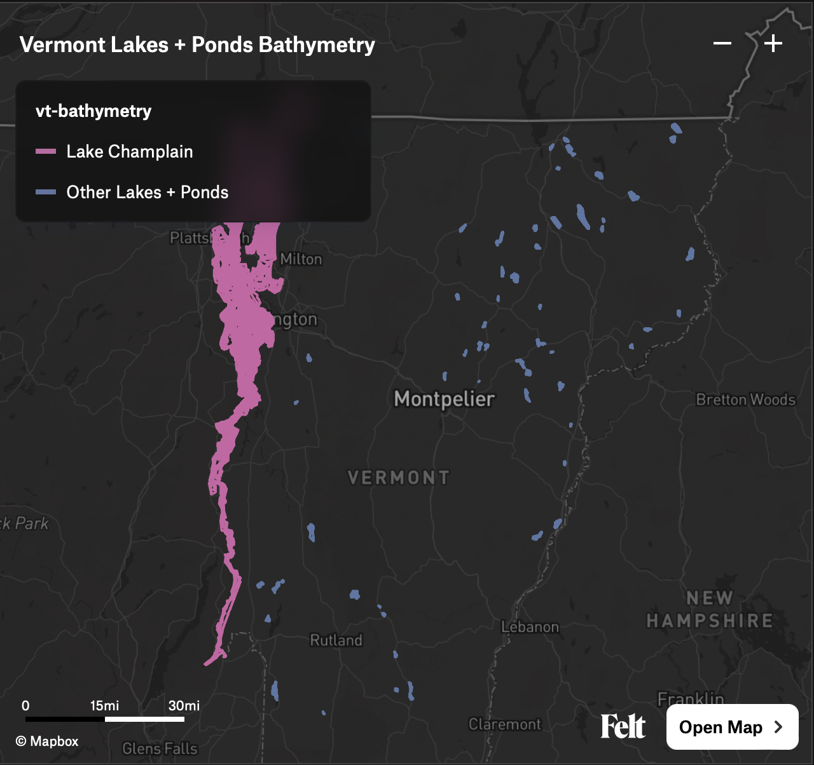

---
cover:
  image: felt-map.png
date: 2023-11-27
description: "Isobaths for Vermont lakes and ponds as GeoJSON and PMTiles"
externalUrl: "https://github.com/cboone/vermont-lakes-and-ponds-bathymetry"
title: "Vermont Lakes and Ponds Bathymetry"
---

Isobaths (underwater contour lines) generated for all Vermont lakes and ponds with available bathymetric data. Currently that's a small fraction of the actual lakes and ponds in Vermont. Generated for use on [the Catamount Hardware Ice Atlas](https://catamounthardware.com/atlas/).

## Processed files

- [Lake Champlain isobaths as GeoJSON](https://github.com/cboone/vermont-lakes-and-ponds-bathymetry/blob/main/bathymetry/champlain-bathymetry.geojson)
- [Vermont (non-Champlain) lake and pond isobaths as GeoJSON](https://github.com/cboone/vermont-lakes-and-ponds-bathymetry/blob/main/bathymetry/vt-bathymetry.geojson)
- [Combined bathymetry as PMTiles](https://github.com/cboone/vermont-lakes-and-ponds-bathymetry/blob/main/bathymetry/vt-combined-bathymetry.pmtiles)

View the combined bathymetry [on Felt](https://felt.com/map/Vermont-Lakes-Ponds-Bathymetry-dcDtYi3NT36UCpbrhi6udA) or via [the PMTiles Viewer](https://protomaps.github.io/PMTiles/?url=https%3A%2F%2Fraw.githubusercontent.com%2Fcboone%2Fvermont-lakes-and-ponds-bathymetry%2Fmain%2Fbathymetry%2Fvt-combined-bathymetry.pmtiles#map=6.16/44.397/-71.466).

## Sources

### Lake Champlain

[Lake Champlain Bathymetry points](https://geodata.vermont.gov/datasets/7f451335fc6644e7a7376adbcd6282df_2/about) for general mapping purposes only.

The `ElevationDEM_LKCHDEM` data layer includes bathymetric data derived from NOAA nautical charts. All points were digitized from the RF 40,000 scale NOAA charts for Lake Champlain.

### Vermont (non-Champlain) lakes and ponds

[Bathymetric Data](https://geodata.vermont.gov/datasets/VTANR::bathymetric-data/about) showing depth (ft) and location for various lakes and ponds in Vermont. Water depth is relative to pool elevation at the time of collection.

## See also

### [Catamount Hardware Ice Atlas](https://catamounthardware.com/atlas/)

Interactive map of Vermont ice conditions, including lake and pond depths.

### [Felt](https://felt.com/)

Collaborative mapping platform used to visualize the bathymetry data.

### [PMTiles](https://github.com/protomaps/PMTiles)

Single-file tile archive format for efficient web map serving.

### [QGIS Contour Plugin](https://github.com/cboone/QGIS-Contour-Plugin)

My fork of the QGIS plugin used to generate the isobaths.
