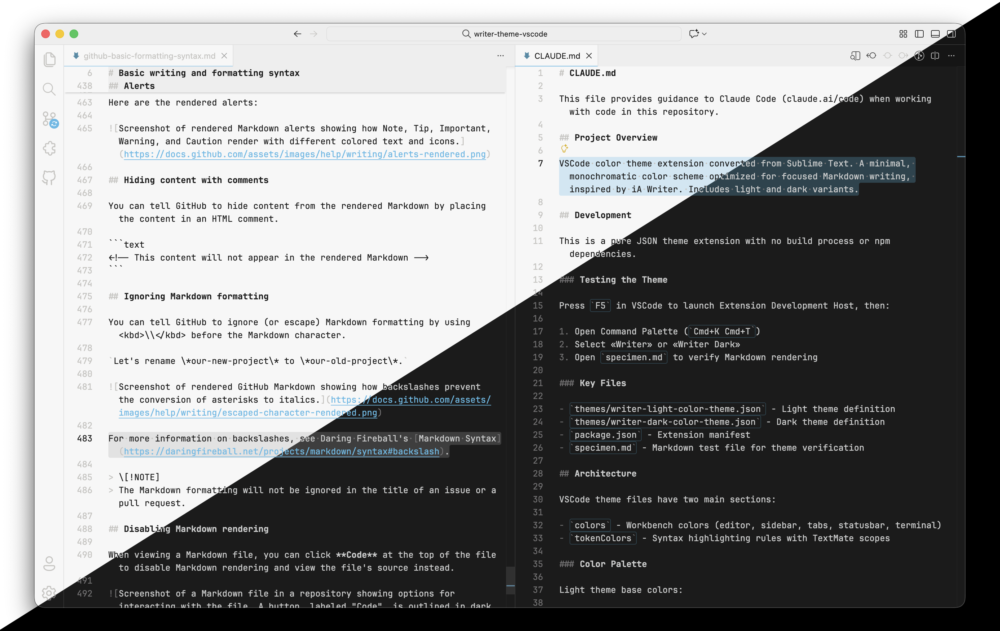

---
cover:
  image: writer-combined.png
date: 2026-01-20
description: "A VS Code color theme for focused long-form writing"
externalUrl: "https://github.com/cboone/writer-theme-vscode"
title: "Writer Theme for VS Code"
---

A VS Code port of [Tonsky's Sublime Text theme](https://github.com/tonsky/sublime-scheme-writer), designed for distraction-free long-form writing.

## Background

Tonsky designed the original Writer theme to replicate [iA Writer](https://ia.net/writer)'s minimalist approach while leveraging a full-featured editor's capabilities. His philosophy centers on achieving "the perfect balance between features and simplicity, design and focus."



## Features

- Monochromatic palette minimizing visual distractions
- Optimized for Markdown
- Light and dark variants
- Designed to pair with [Writer font](https://github.com/tonsky/font-writer) at 16px

## Installation

Search for "Writer Theme" in the VS Code extension marketplace, or run:

```text
ext install cboone.writer-theme-vscode
```

## See also

### [iA Writer](https://ia.net/writer)

The app that inspired this theme's design philosophy. Hard to beat it.

### [iA Fonts](https://github.com/iaolo/iA-Fonts)

iA's modifications of IBM Plex Mono. These fonts are gorgeous. They're variable fonts, thus can be adjusted in every way possible. They're fully internationalized.

iA Writer Mono is a cleaned up variant of Plex Mono. iA Writer Duo is the same, but with several characters (such as `W` and `M`) expanded to 150% of the rest. iA Writer Quattro is the same as Duo, but with some characters (such as `f` and `t`) shrunk to 75%, and some (such as `i` and `j`) shrunk to 50%. Which, in the end, makes for a proportional monospaced typeface.

Read more about them in iA's blog post ["A Typographic Christmas"](https://ia.net/topics/a-typographic-christmas).

### [Writer font](https://github.com/tonsky/font-writer)

Tonsky's modified IBM Plex Mono, optimized for writing, "with increased letter-spacing and tuned weights."

### [Alabaster color theme](https://github.com/tonsky/sublime-scheme-alabaster)

Tonsky's minimal color scheme for coding, based on his philosophy of syntax highlighting, described in his blog post ["A case against syntax highlighting"](https://tonsky.me/blog/syntax-highlighting/).

Available for [a very wide range of tools](https://github.com/cboone/alabaster-themes-for-terminals#related-themes), including [my versions for terminal emulators](https://github.com/cboone/alabaster-themes-for-terminals).

### [Fira Code](https://github.com/tonsky/FiraCode/)

Tonsky's beautiful update of [Fira Mono](https://github.com/mozilla/Fira) for coding, with monospaced ligatures. Pairs very well with Alabaster.

## Credits

Original theme by [Nikita Prokopov](https://github.com/tonsky).
